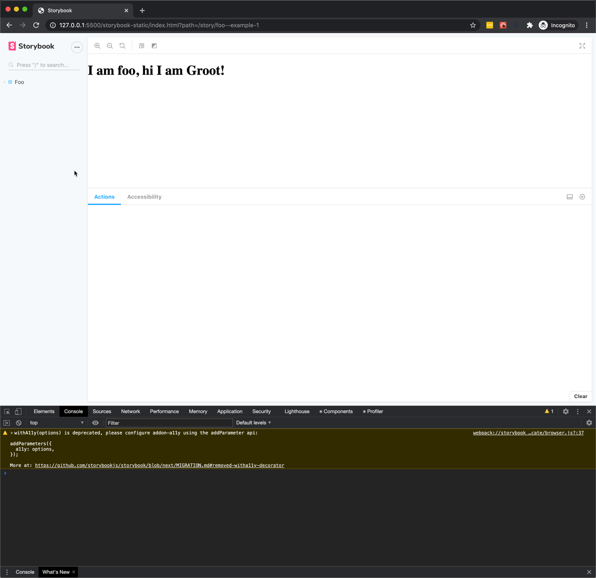
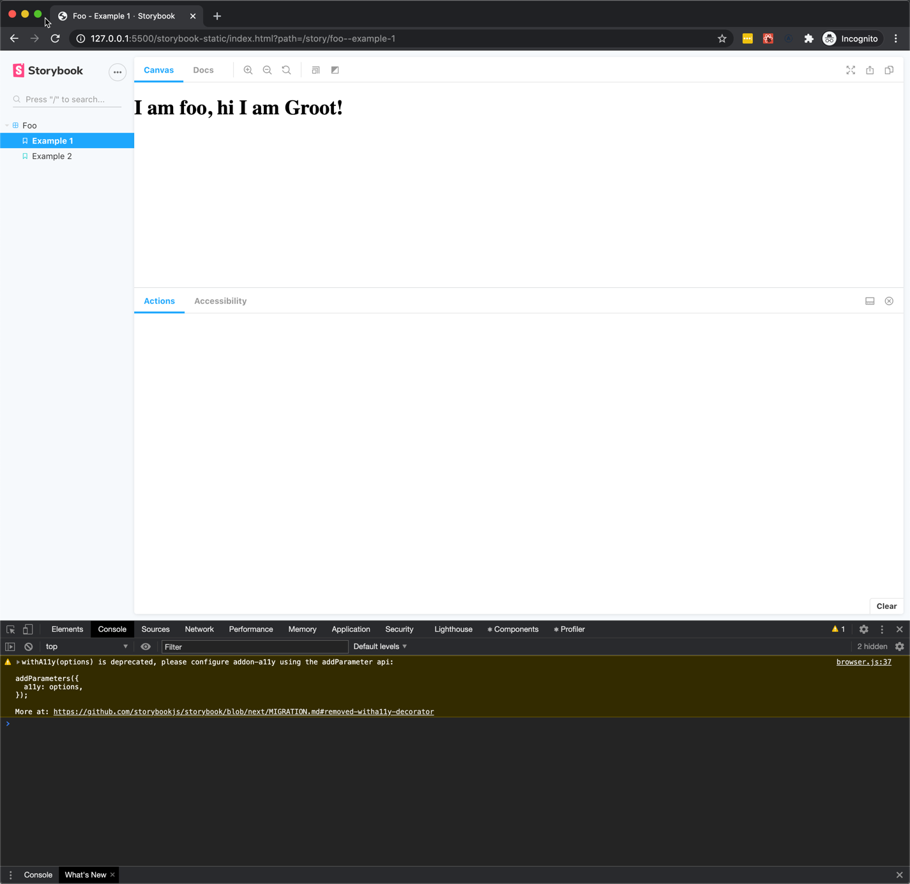

# Storybook published build not working as expected

Running `yarn build-storybook` builds storybook, but when viewing the output in the browser the routing does not work.
When clicking on a story in the side nav the clicked story does not load

Steps To build the project:

- `yarn`
- `yarn build-storybook`
- `npx http-server ./storybook-static`

Observe that the routing does not work as expected.

1. Here is the result of the initial page load, note that the Docs tab is not visible:

2. Here is the result when the page is reloaded/refreshed. Note that the Docs tab is now visible:

